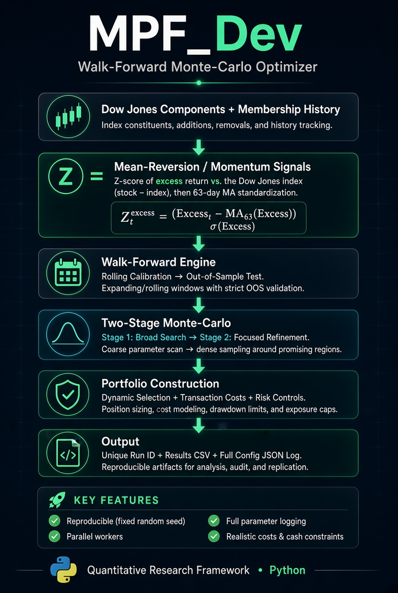
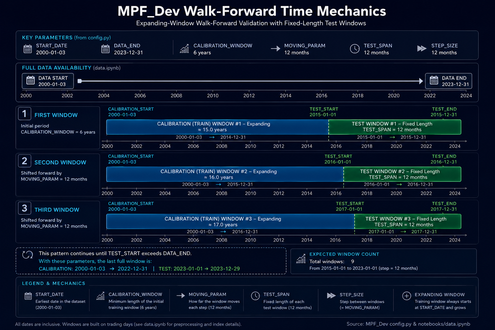
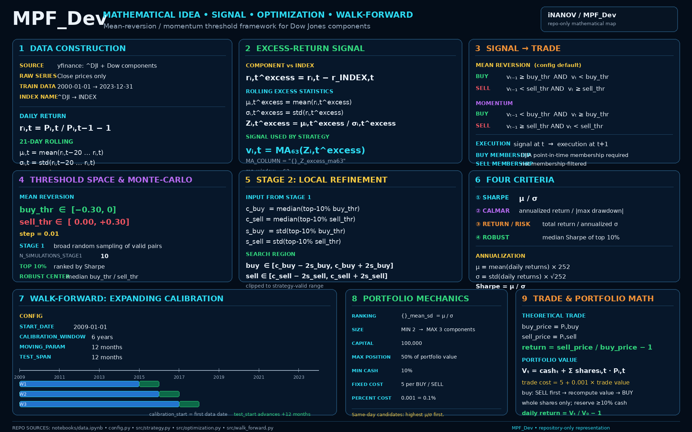

# MPF_Dev

Walk-forward Monte-Carlo optimization framework for mean-reversion and momentum strategies on Dow Jones components.

## Quick Start

1. **Prepare the data**  
   Open and run `notebooks/data.ipynb`.  
   This downloads historical prices and builds the dataset used by the optimizer.

   Important: set the end date of the training period carefully, for example:

   ```python
   # TRAIN DATA
   data_df = prepare_data(
       "^DJI",
       dow_membership["ticker"].tolist(),
       "2000-01-01",
       "2023-12-31"
   )
   ```

   Everything up to this date will be available for walk-forward calibration.  
   Later, when you want to evaluate a strategy on newer data, simply extend the end date and re-run the notebook. In the results you can then focus only on the period after `2023-12-31`.

2. **Configure the experiment**  
   Edit `config.py` to choose the strategy, walk-forward windows, Monte-Carlo settings, portfolio constraints, etc.

3. **Launch the optimization**  
   ```bash
   python scripts/run_walk_forward_optimization.py
   ```

   Results (CSV + full parameter log) are automatically saved in the `results/` folder with a unique run ID.

## Project Structure

- `notebooks/data.ipynb` — data download & preparation
- `config.py` — all experiment parameters
- `scripts/run_walk_forward_optimization.py` — main entry point
- `src/` — core walk-forward, optimization and strategy logic

---

<p align="center">
  
</p>

---

<p align="center">
  
</p>

---

<p align="center">
  
</p>

